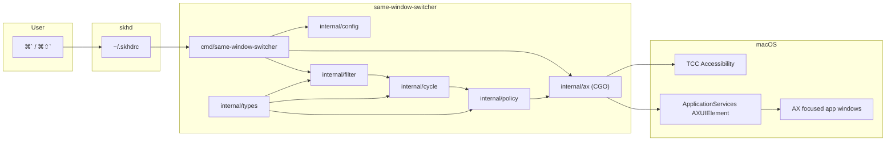
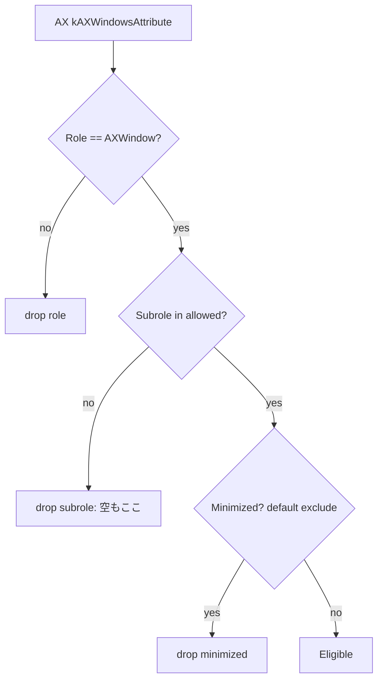

# macos-same-window-switcher 設計ドキュメント

| 項目 | 値 |
|---|---|
| Title | macos-same-window-switcher: 同一アプリ内ウィンドウ循環 CLI |
| Author | TBD |
| Date | 2026-09-05 |
| Status | Draft (rev. 3) |
| Module | `github.com/haruyama480/macos-same-window-switcher` |
| Binary | `same-window-switcher` |
| Platform | macOS 13 Ventura — macOS 26 Tahoe (Apple Silicon / Intel) |
| Test hosts | 作者の日常機で手動受け入れ。CI は Linux 上の pure Go パッケージ必須。darwin CI は任意 |
| Language | Go 1.22+ with CGO (`ApplicationServices`) |

用語: 本文の「前面アプリ」は **AX の focused application**（キーボード入力を受けているプロセス）を指す。`NSWorkspace.frontmostApplication` ではない。 palettes / セキュア入力で両者はズレうる。skhd から叩く用途では focused が正しい。

---

## Overview

macOS の標準ショートカット ⌘`` は「同一アプリのウィンドウを次へ」を担うが、Stage Manager との衝突、最小化ウィンドウでの破綻、3 枚以上での飛び越し、Space を跨げない、といった不具合・制限が長年残っている。ユーザーは既に **skhd** でアプリ単位の focus を組んでおり、欠けているのは **いまキーボードフォーカスがあるアプリのウィンドウだけを next / prev する小さな CLI** である。

本ツールはキーバインドを持たない。skhd（または Karabiner / AeroSpace `exec-and-forget`）が `same-window-switcher next` / `prev` を起動する。実装は Go + CGO で **公開 Accessibility API (`AXUIElement`)** を直接呼び、focused アプリの標準ウィンドウを列挙して 1 枚 raise する。起動はワンショット、成功時は無言、失敗時だけ stderr。設定ファイル無しでも動く。ソート方針とリスト再構築方針は最初から interface 化し、後からポリシーを足せるようにする。

---

## Background & Motivation

### 現状

- アプリ切り替え: ⌘Tab、skhd の `open -a` / `osascript`、yabai / AeroSpace の app セレクタ。
- 同一アプリ内ウィンドウ: 標準 ⌘``（System Settings → Keyboard → Keyboard Shortcuts → Keyboard → *Move focus to next window*）。
- ユーザーの痛み: この ⌘`` が信頼できない。skhd 側に「同じアプリの次ウィンドウ」を渡す単機能バイナリが無い。

### 標準 ⌘`` の既知の挙動と欠陥

| 現象 | 出典・観察 |
|---|---|
| 同一 Space の同一アプリウィンドウだけを循環 | Apple サポート文書、Super User。他 Space のウィンドウは対象外 |
| Stage Manager 有効時、ショートカットの意味が「同一 stage 内（アプリ横断）」に変わる | Apple Community, Sonoma |
| 最小化ウィンドウがあるとサイクルが壊れる | HN on [Sash](https://github.com/tacomanator/sash) |
| Ventura 以降、端まで行くと wrap しない報告 | OSXDaily コメント |
| キーリピートで 1 打鍵が 2〜5 枚飛ばす | Apple Community（Stage Manager 時） |
| z-order を毎回読み直すと、raise した瞬間に順序が崩れ同じ窓を再訪 / 飛ばす | [Sash `WindowSwitcher.swift`](https://github.com/tacomanator/sash/blob/main/Sources/WindowSwitcher.swift) が独立した rotation list を持つ理由 |

⌘Tab は modifier を押している間リストが sticky。⌘`` はオーバーレイが無くその場 raise するため、**naive に「今の z-order の次」を取ると循環が壊れる**。これが本設計の中心問題である。Sash は常駐プロセス内で `kAXWindowsAttribute` の先頭を「今の表窓」とし、それとは独立した `rotationOrder` を進める。本ツールはワンショットなので、同等の「現在窓の定義」と snapshot をファイルに持つ。

### 先行実装（本ツールが置き換えないもの）

| ツール | 何をするか | 本ツールとの差 |
|---|---|---|
| 標準 ⌘`` | 同一アプリ next window | キーバインドが OS 所有。不安定。skhd から呼べない |
| [Sash](https://github.com/tacomanator/sash) | AX で前面アプリを循環。独自ホットキー。メニューバー常駐 | 最も近い。Go CLI ではなく Swift アプリ。skhd 非前提 |
| [window-cycle](https://github.com/WhiteMinds/window-cycle) | ⌘`` オーバーレイ。AX + CGEvent tap | TUI/パネル付き。Input Monitoring が要る |
| [AltTab](https://github.com/lwouis/alt-tab-macos) | 全アプリのウィンドウスイッチャー | アプリ横断。常駐。重たい |
| [Contexts](https://contexts.co) | 商用ウィンドウスイッチャー | 同上 |
| yabai + jq | `query --windows \| jq` で同アプリを `sort_by(.space,.frame.x,.frame.y)` して `--focus` | SIP / scripting addition 前提。skhd から jq を毎回起動すると遅い |
| AeroSpace | `list-windows` + `focus --window-id` | タイル WM 全体の一部。単体ユーティリティではない |
| Hammerspoon `hs.window.filter` / AppWindowSwitcher.spoon | Lua で循環 | Hammerspoon 常駐が前提 |
| Rectangle | スナップ / リサイズ | 循環はしない。AX の使い方は参考になる |

本ツールの立ち位置は **Sash のコア循環ロジックを、skhd 向けの無 UI ワンショット CLI として切り出したもの** である。フィルタのデフォルトは Hammerspoon `isStandard()` に寄せ、yabai の「real window」（Dialog / Floating / layer 0 を含む）や AltTab のアプリ例外表は真似しない。

---

## Goals & Non-Goals

### Goals (v1)

1. キーボードフォーカス中のアプリ（AX focused application）の標準ウィンドウを next / prev で循環する CLI。
2. キーバインドは持たない。skhd から呼ぶ前提。
3. サブコマンド `next` / `prev`（必須）。診断用に `list` / `doctor` / `version`。
4. Go 実装。CGO で `ApplicationServices` の C API を直接呼ぶ。
5. デフォルトのソート方針を 1 つ決め、`SortPolicy` interface で後から追加可能にする。
6. ウィンドウリストの snapshot / reuse / rebuild を明示的な状態機械にする（⌘`` の「sticky cycle」相当）。
7. ゼロ設定で動く。設定ファイルは任意。
8. 成功時 stdout なし。失敗時は意味のある exit code。
9. Accessibility 未許可を検出し、System Settings への案内と `.app` フォールバックを `doctor` が出す。
10. **Latency stretch（約束ではない）:** Apple Silicon・ウォームキャッシュで p95 <40ms を狙う。PR 5 で `elapsed=` を測る。作者マシンで p95 >80ms が再現したら v1.1 で daemon を検討する。Intel / cold cache では超えてよい。キーリピートは flock で直列化し、飛ばさないことを優先する。

### Non-Goals (v1)

- ホットキー登録（Carbon `RegisterEventHotKey`、CGEvent tap、メニューバー）。
- オーバーレイ UI / サムネイル（AltTab / window-cycle の領域）。
- アプリ横断スイッチャー。
- 他 Space のウィンドウへ Space を切り替えて focus（private SkyLight / SIP 解除が要る）。
- ウィンドウの move / resize / close。
- Screen Recording 権限を要求する実装（`kCGWindowName` に頼らない）。
- 常駐 daemon / AXObserver（MRU の真の履歴）。v1 はファイルベースの sticky state で足りる。
- コード署名・公証・App Store。個人用。ad-hoc 署名と最小 `.app` ラッパは TCC 用に v1 で用意する。
- Windows / Linux（実行対象。Linux 上のユニットテストは行う）。
- ネイティブ ⌘`` の無効化をプログラムから行うこと（ユーザーが System Settings で外す）。
- CG window layer によるフィルタ（yabai の layer 0）。v1 は AX subrole のみ。
- アプリ hidden 状態のフィルタノブ（focused app が hidden なことは practically 無い）。

---

## Key Decisions

1. **ワンショット CLI + `$TMPDIR` の sticky cycle state。常駐 daemon は v1 に置かない**  
   skhd はキーごとにプロセスを spawn する。daemon は真の MRU と数 ms の IPC には有利だが、TCC・launchd・クラッシュ復旧が増える。個人ユーティリティとしては過剰。sticky に必要な状態は JSON + `flock` で足りる。起動コストは stretch 目標であり、v1 出荷条件ではない。

2. **ウィンドウ列挙と raise は公開 Accessibility API。CGWindowList は使わない（v1）**  
   列挙: `AXUIElementCreateSystemWide` → timeout 設定 → `kAXFocusedApplicationAttribute` → `AXUIElementCreateApplication(pid)` → `kAXWindowsAttribute`。raise: `kAXRaiseAction` + `kAXMainAttribute = true`。これは [Sash](https://github.com/tacomanator/sash) と [window-cycle](https://github.com/WhiteMinds/window-cycle) が実運用で使っている経路。`CGWindowListCopyWindowInfo` のタイトルは Screen Recording 権限にゲートされ、Tahoe 26.1 では unsigned Unix 実行ファイルが **Privacy & Security の複数項目**（Screen Recording **および Accessibility / FDA**）でリストに出ない既知問題がある。タイトルも bounds も AX から取れるので CG に触らない。Accessibility 側の UI 欠落は `.app` ラッパで吸収する（KD12）。

3. **安定 ID は private `_AXUIElementGetWindow`。失敗時はタグ付き fallback キーであり、uint32 空間を共有しない**  
   AX 要素はプロセスを跨いで保持できない。`_AXUIElementGetWindow` は 2011 年から yabai / AltTab / Sash / Rectangle 系が使っており Tahoe 時点でも生きている。戻り値 `0` は失敗として扱う（有効な `CGWindowID` ではない）。fallback は `(pid, role, subrole, rounded frame)` を文字列キーにし、このスナップショット内で衝突するときだけ title を塩にする。snapshot の `order` は `[]string`（`"w:1234"` / `"f:…"`）。private シンボルが消えたら sticky の品質は落ちる、と明記する。ハッシュを `CGWindowID` に見せかけることはしない。

4. **デフォルトソートは `spatial`。デフォルト循環は sticky snapshot**  
   デーモン無しで決定的。左→右、上→下、同点は `WindowID.String()`。3 枚以上でも「次はどれか」が目で追える。z-order を毎回読むと raise で順序が壊れるので、**サイクル開始時に並べて、sticky 期間中は再利用**する。

5. **対象ウィンドウは Hammerspoon 流 `isStandard`。yabai real-window ではない**  
   デフォルト: `AXRole == AXWindow` かつ `AXSubrole == AXStandardWindow`、非最小化。Dialog / Floating / layer 0 チェックは入れない。yabai #2046 の real window は `AXStandardWindow|AXDialog|AXFloatingWindow` **かつ** layer 0。AltTab はさらにアプリ例外がある。本ツールはそれらに「合わせない」。空 subrole は drop（`list -v` に `dropped=subrole:`）。属性が無いときのデフォルトは後述の表。

6. **他 Space・フルスクリーン Space は AX が返したものだけ。Space 切り替えはしない**  
   非アクティブ Space の AX ツリーは空になることが多く（Safari で再現報告あり）、SLS private API 無しでは raise できない。標準 ⌘`` と同じ制限を受け入れ、ドキュメントする。

7. **キーバインドは skhd。本バイナリは `next`/`prev` だけ**  
   要求どおり。TCC 上、**skhd ではなくこの実行ファイル自身**（またはそれを包む `.app`）を Accessibility に入れる。

8. **設定は TOML、パスは XDG。macOS の `~/Library/Application Support` は使わない**  
   AeroSpace と同じ慣習（`~/.config/...`）。パーサは `github.com/BurntSushi/toml`。sandbox も Launch Services も無い CLI なので Application Support に置く利点が無い。

9. **CGO は薄い C shim。DarwinKit / osascript / Swift helper は採用しない**  
   DarwinKit は NSApplication run loop 前提で CLI に重い。osascript は 50–200ms でキーリピートに負ける。Swift helper はツールチェインが二系統になる。AX は C API なので Go CGO が最短。Objective-C は使わない（`#cgo CFLAGS: -x objective-c` は付けない）。

10. **成功時は exit 0 で無言。ウィンドウが 0〜1 枚でも成功（no-op）**  
    skhd のログを汚さない。権限エラーだけ目立つようにする。

11. **現在窓は 3 段フォールバック。Reuse / row 6 は `CurrentWindow` だけでは見ない**  
    `CurrentWindow` は focused → Main → `AXIndex`。raise は Main だけを書き、`kAXFocusedAttribute` は v1 でセットしない。次起動の focused は古いままになりうる。**row 6（ユーザーが他手段で選んだ）は `RaiseSignal`（eligible の Main、無ければ min `AXIndex`）も `LastRaised` でないときだけ Fresh。** Main == LastRaised なら focused は stale として Reuse。`LastRaised` は **この起動が raise すると決めた窓**。

12. **TCC の第一経路は固定パスの CLI。Tahoe 26.x で Accessibility リストに出ない場合の v1 フォールバックは最小 `.app` ラッパ**  
    unsigned Unix 実行ファイルが Settings UI に出ないのは Screen Recording 限定ではない（26.1 / 26.2 beta で Accessibility でも報告）。`make install-app` が `SameWindowSwitcher.app` を作り、skhd はその中の実行ファイルを叩く。`doctor` が trusted / path / codesign / bundle を出す。

---

## Proposed Design

### コンポーネント

```
skhd  ──exec──►  same-window-switcher next|prev
                      │
                      ├─ config.Load (optional TOML)
                      ├─ ax.Session (timeout on system-wide, then focused app)
                      ├─ ax.Windows(pid) → filter.Eligible
                      ├─ types.CurrentWindow + types.RaiseSignal
                      ├─ cycle.Store (lock → load → step → write Frames → raise → unlock)
                      ├─ policy.Sort (spatial | window-id | z-order | mru)
                      └─ ax.RaiseIndex (same session, kept AXUIElementRef)
```



### パッケージレイアウト

```
.
├── cmd/same-window-switcher/main.go
├── internal/
│   ├── types/              # Window, WindowID, Rectangle, CurrentWindow, RaiseSignal
│   ├── ax/                 # CGO: session, enumerate, raise, permission
│   │   ├── ax.go
│   │   ├── ax_darwin.go    # //go:build darwin
│   │   ├── ax_darwin.c
│   │   ├── ax_darwin.h
│   │   └── ax_stub.go      # //go:build !darwin
│   ├── filter/
│   ├── policy/
│   ├── cycle/
│   ├── config/             # Default Config は PR 1 から存在
│   ├── app/                # orchestration: next/prev/list/doctor
│   └── cli/                # flag parsing, exit codes
├── testdata/
├── Makefile
├── go.mod
└── README.md
```

外部依存は最小:

- `github.com/BurntSushi/toml`（設定。PR 6 で導入。PR 1 の `Config` は構造体とデフォルト値のみ）
- 標準ライブラリ + CGO のシステムフレームワーク

`internal/ax` 以外は pure Go。Linux 上で `go test ./internal/types ./internal/policy ./internal/cycle ./internal/filter ./internal/config ./internal/cli` が通る（PR 1 から Makefile の `test` がこれを回す）。

### 起動シーケンス（`next` / `prev`）

```mermaid
sequenceDiagram
  participant S as skhd
  participant C as same-window-switcher
  participant AX as ax.Session
  participant LK as cycle.lock
  participant FS as cycle.json

  S->>C: exec next
  C->>C: runtime.LockOSThread
  C->>C: load config (or defaults)
  C->>AX: ax_is_trusted(prompt=false)
  alt not trusted
    C-->>S: stderr + exit 2
  end
  C->>AX: session_open: CreateSystemWide + SetMessagingTimeout
  C->>AX: kAXFocusedApplicationAttribute
  AX-->>C: pid
  C->>AX: CreateApplication(pid) + kAXWindowsAttribute + attrs
  AX-->>C: []Window + kept AXUIElementRef per index
  C->>C: filter.Eligible
  C->>C: CurrentWindow + RaiseSignal
  alt len(eligible) <= 1
    C-->>S: exit 0 (no-op)
  end
  C->>LK: flock LOCK_EX (cycle.lock)
  C->>FS: read; decode fail → empty
  C->>C: Decide(transition table)
  C->>C: policy.Sort if Fresh; step index
  C->>FS: write tmp + rename
  C->>AX: raise_index (unminimize poll, AXRaise, set Main)
  C->>LK: unlock
  C->>AX: session_close (CFRelease)
  C-->>S: exit 0
```

Latency は **stretch**。PR 5 で `-v` の `elapsed=` と `doctor` の内訳を測るまで数値を出荷条件にしない。

| 段階 | Apple Silicon の目安 | 備考 |
|---|---|---|
| Go runtime + flag parse + config | 8–15ms | Intel / cold cache では大きい |
| AX trusted + focused app + windows | 5–15ms | timeout は system-wide に先にセット。ハング時は最大 `ax_timeout_ms` |
| filter + cycle + flock | <1ms | |
| AXRaise + set main（**同一 session の kept ref。属性の再列挙はしない**） | 2–8ms | リトライ 1 回 + unminimize poll で伸びる |
| **stretch p95** | **<40ms** | ハード上限ではない。計測後に見直す |

キーリピート（初期遅延のあと ~30–50ms 間隔）と one-shot は原理的に重なる。v1 は **cycle.lock を raise 完了まで保持**する（正しさ優先: 次の next が「まだ raise されていない LastRaised」を見て誤 Fresh しない）。ハングした AX は最大 `ax_timeout_ms`（デフォルト 250ms）で打ち切るので、リピートは最大その分待つ。skhd / AeroSpace `exec-and-forget` はプロセスを重ねて spawn し、lock で直列化される。**「体感遅延なし」は約束しない。**

---

## 共有型（`internal/types`）

PR 1 で置く。policy / cycle / filter / ax が同じ `Window` を使う。

```go
package types

type IDKind int

const (
    IDCGWindow IDKind = iota // "_AXUIElementGetWindow" が 0 以外を返した
    IDFallback               // それ以外。CGWindowID 空間とは混ぜない
)

type WindowID struct {
    Kind IDKind
    CG   uint32 // Kind==IDCGWindow のときのみ。0 は無効
    Key  string // Kind==IDFallback のとき必須
}

func (id WindowID) String() string {
    if id.Kind == IDCGWindow {
        return fmt.Sprintf("w:%d", id.CG)
    }
    return "f:" + id.Key
}

type Rectangle struct{ X, Y, W, H float64 }

type Window struct {
    ID         WindowID
    PID        int32
    Role       string
    Subrole    string
    Title      string
    Frame      Rectangle // global, top-left origin (AX)
    Minimized  bool
    Fullscreen bool // 私有 AXFullScreen。無ければ false
    Main       bool
    Focused    bool
    AXIndex    int  // kAXWindowsAttribute における元の添字（z-order / raise）
}
```

`WindowID` の割り当ては **Go 側**（C は `cg_window_id==0` で「無し」を返す）:

1. `_AXUIElementGetWindow` が `kAXErrorSuccess` かつ `wid != 0` → `IDCGWindow`。
2. それ以外 → fallback キー。まず
   `fmt.Sprintf("%d|%s|%s|%.0f|%.0f|%.0f|%.0f", pid, role, subrole, round(x), round(y), round(w), round(h))`
   （座標は 1pt に四捨五入）。
3. この呼び出しで得た eligible 集合の中でキーが衝突したら、衝突している窓にだけ `|t:` + title を付ける。title は毎回変わるので **衝突時の塩** であり、通常の identity には使わない。
4. キー文字列をそのまま `IDFallback.Key` にする（32-bit に畳まない）。UTF-8 として扱う。C の `title[512]` を切るときは末尾が不完全なシーケンスにならないよう先頭バイトまで戻す。

private シンボル欠落時: すべての ID が fallback になる。ドラッグで frame が変わると ID が変わり、sticky は Fresh に落ちる。それを **受け入れ済みの劣化** とする。

---

## ウィンドウの識別と「同一アプリ」

### フォーカス中アプリの取り方（AppKit を使わない）

CLI で `NSWorkspace` / `NSRunningApplication` を使うと AppKit 初期化コストと「activate が全ウィンドウを上げる」罠がある。対象アプリは AX focused application だけを使う。

```c
AXUIElementRef sys = AXUIElementCreateSystemWide();
AXUIElementSetMessagingTimeout(sys, timeout_sec); // 先。Apple: system-wide にセットするとプロセス全体の既定になる
CFTypeRef focused = NULL;
AXError err = AXUIElementCopyAttributeValue(sys, kAXFocusedApplicationAttribute, &focused);
pid_t pid = 0;
AXUIElementGetPid((AXUIElementRef)focused, &pid);
```

Sash は `NSWorkspace.shared.frontmostApplication`。本ツールは skhd 向けなので **キーボードフォーカス** を取る。Terminal から `list` を叩くと Terminal 自身が出る。

「同一アプリ」の単位は **pid**。Chrome のプロファイル複数プロセスは pid が違うので別サイクル（ネイティブ ⌘`` と同じ）。

bundle id は v1 の snapshot に **入れない**。`proc_pidpath` は実行ファイルパスであり bundle id ではない。`list` / `doctor` がパスを出したければ `proc_pidpath` でよい。CFBundleIdentifier が欲しくなったら `.app/Contents/Info.plist` を歩くか `SecCode` を使う（v1 ではやらない）。

### 現在窓アルゴリズム（sticky の入力）

`kAXFocusedWindowAttribute`（アプリ）、窓の `kAXFocusedAttribute`、`kAXMainAttribute`、`kAXWindowsAttribute[0]` は一致しない。Apple は Main が key focus を含意しないと明記している。多くのアプリは `AXFocused` を更新しない。

Sash は focused を読まず `windowIDs[0]`（AX 配列先頭）を表窓とする。本ツールの `CurrentWindow` は focused を優先する（クリック / ⌘Tab の検出用）。**ただし raise は Main だけを書き focused は触らない**ので、次のワンショットで step 1 が *一つ前の key window* を返しうる。それを row 6 の「ユーザーが選んだ」と誤認すると sticky が毎回 Fresh になる。対策は `RaiseSignal`（本ツールが実際に mutate する信号）で stale focused を捨てること。focused を raise 後にセットする案と Main 優先に Invert する案は採らない。

```go
// CurrentWindow は eligible に入っている窓だけを候補にする。
// 保存ダイアログだけが key のとき（include_dialogs=false）は「現在窓なし」。
// Fresh の開始 index と row 5（current ∉ Order）に使う。Reuse の起点には使わない。
func CurrentWindow(focusedAX WindowID, eligible []Window) (id WindowID, ok bool) {
    // 1. アプリの kAXFocusedWindowAttribute → WindowID。eligible にあればそれを返す。
    if focusedAX valid && contains(eligible, focusedAX) {
        return focusedAX, true
    }
    // 2. eligible のうち kAXMainAttribute == true の最初（AXIndex 昇順）。
    if w, ok := first(eligible, func(w Window) bool { return w.Main }); ok {
        return w.ID, true
    }
    // 3. eligible を AXIndex 昇順（元の kAXWindowsAttribute 順）で最初。
    if len(eligible) > 0 {
        return minAXIndex(eligible).ID, true
    }
    return WindowID{}, false
}

// RaiseSignal は本ツールの raise が書き込むもの（Main）。無ければ配列先頭。
// row 6 の「他手段で選んだ」判定と、stale focused の検出に使う。
func RaiseSignal(eligible []Window) (id WindowID, ok bool) {
    if w, ok := first(eligible, func(w Window) bool { return w.Main }); ok {
        return w.ID, true
    }
    if len(eligible) > 0 {
        return minAXIndex(eligible).ID, true
    }
    return WindowID{}, false
}
```

C 側はアプリの `kAXFocusedWindowAttribute` を 1 回取り、その要素の `_AXUIElementGetWindow`（または fallback キー用の role/subrole/frame）を返す。窓ごとの `kAXFocusedAttribute` は `Window.Focused` に入れるが、CurrentWindow の一次ソースにはしない（ログ / `list` 用）。step 1 はアプリ属性 `kAXFocusedWindowAttribute` だけ。

**現在窓が eligible に無い（ok=false）とき:**

- Fresh の開始 index は「無し」。`next` は `Order[0]`、`prev` は `Order[len-1]` を raise する。
- 遷移表 row 5（`current ∉ Order`）。

`LastRaised` は **この起動が raise すると決めた ID** を、ロック区間内で snapshot に書く。起動前の focused を LastRaised にコピーしない。Reuse / Merge の **ステップ起点は常に LastRaised**（残っていれば）。`CurrentWindow` が stale focused を返しても起点を動かさない。

---

## 対象 / 非対象（デフォルトフィルタ）

パイプライン（順序固定）:



allowed subrole デフォルト: `AXStandardWindow` のみ。

属性が欠ける / 読めないときのデフォルト（Sash に合わせ、minimized 読み失敗は「可視」）:

| 属性 | 欠損時 | 備考 |
|---|---|---|
| `kAXRoleAttribute` | drop（role 空） | |
| `kAXSubroleAttribute` | drop（allowed に無い） | 空 subrole の実窓は `list -v` で `dropped=subrole:`。v1 では拾わない |
| `kAXMinimizedAttribute` | `false`（可視） | Sash: 読み失敗なら filter を通す |
| `kAXMainAttribute` | `false` | |
| `kAXFocusedAttribute` | `false` | CurrentWindow の一次ソースではない |
| `kAXPositionAttribute` / `kAXSizeAttribute` | frame ゼロ。spatial では原点扱い | 列挙自体は落とさない |
| `AXFullScreen`（**私有** `kAXFullScreenAttribute`） | `false`。失敗しても列挙を落とさない | 公開 API の `kAXFullScreenButtonAttribute` はボタン要素であり boolean ではない。v1 は optional 読み |
| `kAXHiddenAttribute`（**アプリケーション**） | 読まない | v1 に `include_hidden` ノブは置かない。focused app が hidden なことは practically 無い |
| CG window layer | 検査しない | `LayerOK` フィールドは持たない |

| ケース | 扱い | 理由 |
|---|---|---|
| Chrome / Safari の複数ウィンドウ | 含む | `AXStandardWindow` |
| VS Code / Electron の実ウィンドウ | 含む | 同上。DevTools も Standard になりがち → サイクル対象として妥当 |
| タイトル空（一部 PWA、無題エディタ） | 含む | タイトルは identity の通常入力に使わない |
| `AXDialog` / `AXSystemDialog` | 除外 | `include_dialogs=true` で解除（PR 7） |
| `AXSheet` / `AXDrawer` / `AXUnknown` | 除外 | |
| `AXFloatingWindow` | 除外 | `include_floating=true` で解除（PR 7） |
| `AXPopover` | 除外 | |
| 最小化 | 除外 | `include_minimized=true` のときは **必ず unminimize してから Raise**。config で `include_minimized=true` かつ `unminimize=false` は起動時エラー |
| フルスクリーン（専用 Space） | AX が返せば含む | 他 Space のフルスクリーンは通常返らない |
| 他 Space の通常ウィンドウ | AX が返す範囲のみ | |
| 他ディスプレイ（同一 Space） | 含む | spatial がグローバル座標で並べる |
| Stage Manager の別セット | AX が返せば含む | ネイティブ ⌘`` とは意味が違う。OS 側ショートカットを切る |
| シート表示中の親ウィンドウ | 親は含む、シートは除外 | 現在窓がシートなら CurrentWindow は ok=false → `Order[0]` / last |

AltTab のアプリ例外（Steam, WoW, Adobe Audition 等）は積まない。入らないアプリは `list -v` で切り分ける。

---

## ソートポリシー

```go
package policy

type Context struct {
    Current   types.WindowID // CurrentWindow の結果。ok=false なら zero
    CurrentOK bool
    Now       time.Time
    LastOrder []types.WindowID // 毎回 snapshot.Order を渡す。無ければ nil。mru が使う
}

type SortPolicy interface {
    Name() string
    Sort(windows []types.Window, ctx Context) []types.Window
}
```

登録は `policy.Lookup(name string) (SortPolicy, error)`。未知名は起動時に exit 1。オーケストレーションは **毎回** `ctx.LastOrder = snapshot.Order` を入れる（Fresh でも同じ pid の古い順が残っていれば渡す。mru 近似が空にならないように）。

### `spatial`（**デフォルト**）

1. `Frame.X` 昇順（左 → 右）
2. `Frame.Y` 昇順（上 → 下）
3. `ID.String()` 昇順（安定 tie-break）

複数ディスプレイはグローバル座標のまま。左側のディスプレイが先。

### `window-id`

`IDCGWindow` を `CG` 昇順。`IDFallback` はその後ろで `Key` 昇順。生成順の近似。

### `z-order`

`AXIndex` 昇順 = `kAXWindowsAttribute` の配列順。文書化されていない。このポリシーこそ sticky が必須。

### `mru`（v1 は近似、実装名 `mruApprox`、設定名 `mru`）

1. `Current` を先頭（CurrentOK のとき）
2. 残りは `LastOrder` の相対順
3. どちらにも無い新規は spatial で挿入

真の MRU は `AXObserver` + `kAXFocusedWindowChangedNotification` の常駐が要る。v1 は近似。

ネイティブ ⌘`` に近い体感は `z-order` + sticky。予測可能性は `spatial`。デフォルトは後者。

---

## ウィンドウリスト再構築ポリシー（sticky cycle）

Sash は常駐メモリに `rotationOrder: [CGWindowID]` を持つ。本ツールはワンショットなので同等の JSON を置く。

### 保存場所

```
$TMPDIR/same-window-switcher-$UID/cycle.lock
$TMPDIR/same-window-switcher-$UID/cycle.json
```

例: `/var/folders/.../T/same-window-switcher-501/`

- 起動時 `os.MkdirAll(dir, 0700)`。既存ディレクトリの mode は変更しない。
- `cycle.lock` と `cycle.json` は `0600`。
- flock は **`cycle.lock` の fd** に対する blocking `LOCK_EX`（`LOCK_NB` ではない）。キーリピートは待つ。
- `cycle.json` を flock しない（rename で inode が変わるため）。
- 読み: ファイル無し → 空 snapshot。JSON デコード失敗 / `Version != 1` → 空として Fresh（部分書き込みを検出する）。
- 書き: 同じディレクトリの `cycle.json.tmp` に書いて `os.Rename`（同一 fs なら atomic）。
- **ロック保持区間:** open lock → read → Decide → write → **raise** → unlock。raise をロック外に出すと、次の next が「LastRaised は新しいが AX 上の現在窓はまだ古い」を見て誤 Fresh する。ハング時の待ち上限は `ax_timeout_ms`。これは正しさ vs 待ちのトレードオフであり、v1 は正しさを取る。

```go
type Snapshot struct {
    Version    int      `json:"version"`     // 1
    PID        int32    `json:"pid"`
    Policy     string   `json:"policy"`
    Order      []string `json:"order"`       // WindowID.String()
    LastRaised string   `json:"last_raised"` // この起動が raise すると決めた ID
    LastUsedMS int64    `json:"last_used_ms"`
    StartedMS  int64    `json:"started_ms"`
    Frames     map[string][4]float64 `json:"frames"` // 毎回書く。id → {x,y,w,h}
}
```

`BundleID` は持たない。時刻は Unix epoch **ミリ秒**。フィールド名に `unix` と `ms` を混在させない。

`Frames` は **Fresh / Merge / Reuse のどの write でも**、この起動の eligible 全窓について `id.String() → {X,Y,W,H}` を書き直す（前回の累積ではない）。`omitempty` にしない。row 8 の比較対象は「ディスク上の snapshot.Frames」対「この起動の eligible frame」。

### 遷移表（上から最初に当たった行）

入力は「この起動で得た eligible」「`CurrentWindow` の `(current, ok)`」「`RaiseSignal(eligible)` の `(signal, signalOK)`」「ディスク上の snapshot」。

| # | 条件 | 動作 |
|---|---|---|
| 1 | snapshot 無し / JSON 壊れている / `Version != 1` | **Fresh** |
| 2 | `now - LastUsedMS > sticky_ms`（デフォルト 2000） | **Fresh** |
| 3 | `snapshot.PID != focused pid` | **Fresh** |
| 4 | `snapshot.Policy != 現在の policy 名` | **Fresh** |
| 5 | `!ok` または `current.String() ∉ snapshot.Order`（現在窓が閉じた / 非eligible / 置換） | **Merge**（`on_membership_change=merge`）または **Fresh**（`rebuild`） |
| 6 | `current ∈ Order` かつ `current != LastRaised` **かつ** `signalOK && signal != LastRaised`（クリック / ⌘Tab。focused だけズレて Main が LastRaised なら **stale focused → この行に入らない**） | **Fresh** |
| 7 | eligible の ID 集合 ≠ `Order` の集合（他の窓の open/close のみ） | **Merge** または **Fresh**（設定どおり） |
| 8 | policy が `spatial` かつ、両方に残っている **各** ID について Chebyshev `max(\|dx\|,\|dy\|,\|dw\|,\|dh\|) > 8` が **1 つでも** 真（ドラッグ / ディスプレイ再構成） | **Fresh** |
| 9 | それ以外 | **Reuse** |

row 6 の意図: raise は Main だけ更新する。次起動で `CurrentWindow` step 1 が古い focused を返しても、`RaiseSignal`（Main、無ければ min `AXIndex`）がまだ `LastRaised` ならユーザーは他手段で選んでいない → Reuse。ユーザーが本当に別窓をクリックすると Main も focused もそちらへ移るので row 6 が発火する。

row 8 の距離: AX ポイント単位の Chebyshev。例: `dx=9, dy=0, dw=0, dh=0` は移動。`dx=8` は移動ではない（`>` であり `>=` ではない）。**1 窓でも** 超えれば Fresh。比較する ID は `snapshot.Order ∩ eligible IDs`。snapshot に `Frames` キーが無い（古いファイル / 欠損）→ その ID は動いていないとみなし **Fresh しない**。fallback `f:` キーはドラッグで ID 自体が変わるので row 8 は主に `w:` 用。

Space / Stage Manager の切替は v1 で Space ID を読めない。AX が返す集合が変われば 5/7 が処理する。集合が変わらない sticky 窓だけの切替は検知できない（SLS が要る。非ゴール）。

**Reuse:** `Order` を保ち、**起点は常に `LastRaised`**（`CurrentWindow` が stale focused を返しても）。そこから `next` は +1、`prev` は -1。`wrap=true` で循環。`LastRaised ∉ Order` は row 5 で先に落ちる。

**Merge:** 消えた ID を `Order` から削除。新しい ID を挿入（spatial なら現在の frame で座標位置、それ以外は末尾）。**起点は `LastRaised` が新 Order に残っていればそれ**（stale focused で current が別 ID でも）。残っていなければ `next`→`[0]`、`prev`→last。

**Fresh:** eligible を policy でソートして新しい `Order` にする。`ok && current ∈ Order` ならその **次 / 前** を raise。`ok=false` または current が非 eligible なら `next`→`Order[0]`、`prev`→last。

eligible が 0 または 1 枚: snapshot に触らず exit 0（no-op）。1 枚のとき古い snapshot は残してよい（次に 2 枚以上になったとき #2/#3/#5 で自然に Fresh/Merge）。

`sticky_ms` を「⌘ を離すまで」にできないのは、modifier 観測が Input Monitoring / event tap を要するため。2000ms は連打・リピートを同一サイクルに残し、一呼吸で作り直す。`spatial` / `window-id` は Fresh しても順がほぼ同じ。効くのは `z-order` と `mru`。

ラップ: デフォルト `wrap = true`（Ventura の「端で止まる」バグは再現しない）。

---

## フォーカス（raise）手順

同一 pid 内なので app activate はしない。

同一 `ax_session` が `ax_copy_windows` で保持した `AXUIElementRef` を、**添字で** raise する。pid+id での再列挙はしない（属性コピーの二重化を避ける）。Go は target `WindowID` を今回の `[]Window` から探し、その `AXIndex` ではなく **コピー配列の index** を渡す。

```c
// unminimize が必要なら先に:
AXUIElementSetAttributeValue(window, kAXMinimizedAttribute, kCFBooleanFalse);
// 最大 timeout_ms まで 10ms 間隔で kAXMinimizedAttribute を読み、false になるかタイムアウトまで待つ。
// タイムアウトしても Raise は試みる。

AXUIElementPerformAction(window, kAXRaiseAction);
AXUIElementSetAttributeValue(window, kAXMainAttribute, kCFBooleanTrue);
```

順序: 先に Raise、次に Main。Main だけだと z-order が動かないアプリがある。Raise だけだと key window にならないアプリがある。

`kAXFocusedAttribute = true` は **v1 ではセットしない**（オプション 2 は不採用）。次起動の focused が古くても row 6 が `RaiseSignal`（Main）を見るので sticky は壊れない。Main だけでは key にならないアプリは `list -v` の `focused=` で観察し、必要なら v1.1 で `set_focused` を足す。

`kAXErrorCannotComplete`（`-25204`）は 30ms 待って 1 回リトライ。リトライもロック内。それでも駄目なら unlock して exit 1（stderr に title と生の `AXError`）。

他 Space の窓が AX に載って raise が success でも Space が切り替わらない場合: v1 は success。README の制限。

**やってはいけないこと:**

- `NSRunningApplication activateWithOptions:NSApplicationActivateAllWindows`
- AppleScript `set index of window N`
- `_SLPSSetFrontProcessWithOptions` および生 event record

---

## API / Interface Changes

グリーンフィールド。公開面は CLI のみ。Go の public API は置かない（`internal/`）。

### CLI

```
same-window-switcher <command> [flags]
```

| Command | 意味 |
|---|---|
| `next` | 同一アプリの次ウィンドウを raise |
| `prev` | 前ウィンドウを raise |
| `list` | 対象ウィンドウを 1 行 1 窓で stdout（**デバッグ表示。ABI ではない**） |
| `doctor` | 権限・実行パス・codesign・bundle・タイミング内訳・窓数・config パス |
| `version` | `same-window-switcher 0.1.0 darwin/arm64` |
| `help` | 短い使い方 |

グローバルフラグ:

| Flag | デフォルト | 意味 |
|---|---|---|
| `--config PATH` | 探索順どおり | TOML パス |
| `--policy NAME` | config / `spatial` | この起動だけ上書き |
| `--verbose` / `-v` | false | stderr: pid, id, title, index, action=reuse\|merge\|fresh, `elapsed=12ms` |
| `--dry-run` | false | raise しない。選択印付き |

`next`/`prev` は成功時 stdout 空。

`list` は人間用。title に `=` や空白が入りうる。制御文字だけ空白化する。機械パース用の安定 ABI ではない。必要なら後で `--json`。

```
id=w:1234 ax=0 focused=1 main=1 minimized=0 subrole=AXStandardWindow title=README.md — repo
id=w:1235 ax=1 focused=0 main=0 minimized=0 subrole=AXStandardWindow title=Untitled
```

`-v` の `list` は drop した窓も `dropped=subrole:` などで出す。

### Exit codes

| Code | 意味 |
|---|---|
| 0 | 成功。窓 0〜1 枚の no-op も含む |
| 1 | 実行時エラー（AX 失敗、不明ポリシー、壊れた config）。`ax.Error.Code` は生の負の `AXError` |
| 2 | Accessibility 未許可（`ax_is_trusted` は成功し `trusted=false`） |
| 3 | focused application が取れない（ログイン画面等） |
| 64 | 使い方ミス（未知サブコマンド） |

`ax_is_trusted` 自体が失敗（戻り値 ≠ 0）は exit 1。未許可は exit 2。混ぜない。

### skhdrc 例

US / ANSI で backtick は virtual key `0x32`（`kVK_ANSI_Grave`）。リテラル `` ` `` は skhd のパーサを壊す（[skhd#235](https://github.com/koekeishiya/skhd/issues/235)）。**keycode で書く。**

JIS / その他配列の keycode はドキュメントに数字を書かない。必ず `skhd --observe`（`skhd -o`）で確認する。

先に System Settings で *Move focus to next window* を別キーにするか無効化する。

```
# ~/.skhdrc
# ANSI US: physical grave key. Confirm with: skhd --observe
cmd - 0x32 : /Users/YOU/.local/bin/same-window-switcher next
cmd + shift - 0x32 : /Users/YOU/.local/bin/same-window-switcher prev
```

`.app` 経由のとき:

```
cmd - 0x32 : /Users/YOU/Applications/SameWindowSwitcher.app/Contents/MacOS/same-window-switcher next
```

絶対パス必須。skhd の PATH は login shell と限らない。

skhd はキーリピートでも command を再実行する（公式に no-repeat は無い）。本ツールは flock で直列化する。リピートを止めたい場合は OS のキーリピートを遅らせるか、Karabiner で `to.repeat: false`。

AeroSpace:

```toml
cmd-grave = 'exec-and-forget /Users/YOU/.local/bin/same-window-switcher next'
cmd-shift-grave = 'exec-and-forget /Users/YOU/.local/bin/same-window-switcher prev'
```

AeroSpace の `grave` はレイアウト上の名前で、skhd の `0x32` と **物理キーが一致するとは限らない**。

---

## Data Model Changes

永続 DB は無い。

### 設定ファイル

探索順（先勝ち）:

1. `--config`
2. `$SAME_WINDOW_SWITCHER_CONFIG`
3. `$XDG_CONFIG_HOME/same-window-switcher/config.toml`
4. `~/.config/same-window-switcher/config.toml`
5. 内蔵デフォルト（ファイル無しで success）

`~/Library/Application Support` は探さない。

未知キーはエラー。

v1 コア（PR 6 でファイル化するキー。この時点で動作する）:

```toml
[cycle]
policy = "spatial"          # spatial | window-id | z-order | mru
sticky_ms = 2000
wrap = true
on_membership_change = "merge"  # merge | rebuild

[focus]
raise = true
set_main = true
ax_timeout_ms = 250
raise_retry = 1

[state]
# 空なら $TMPDIR/same-window-switcher-$UID/
dir = ""
```

PR 7 で追加（それまで TOML に書くと未知キーで失敗するので、PR 7 までドキュメント例に出さない）:

```toml
[filter]
include_minimized = false
include_dialogs = false
include_floating = false
# allowed_subroles を書くとデフォルトを置換
# allowed_subroles = ["AXStandardWindow", "AXDialog"]

[focus]
unminimize = false
```

`include_minimized=true` なら `unminimize` を強制 true。矛盾は config load で exit 1。

```go
var Default = Config{
    Cycle: CycleConfig{
        Policy:             "spatial",
        StickyMS:           2000,
        Wrap:               true,
        OnMembershipChange: "merge",
    },
    Filter: FilterConfig{
        AllowedSubroles: []string{"AXStandardWindow"},
    },
    Focus: FocusConfig{
        Raise: true, SetMain: true,
        AXTimeoutMS: 250, RaiseRetry: 1,
        Unminimize: false,
    },
}
```

壊れた TOML は exit 1。壊れた JSON snapshot は捨てて Fresh。

---

## CGO 境界（実装契約）

ヘッダはこれ以上「省略版」にしない。`internal/ax/ax_darwin.c` が使う定数・型・寿命をここに固定する。

### フレームワークとビルド

```
#cgo darwin LDFLAGS: -framework ApplicationServices -framework CoreFoundation
```

CFLAGS に `-x objective-c` も `-fobjc-arc` も付けない。Makefile にも付けない。ソースは C99。AppKit はリンクしない。

Go は AX に触れる間 `runtime.LockOSThread()` する（session_open から session_close まで）。CLI は単一スレッド。AX を任意スレッドから呼んでよい、とは書かない。

### 使う定数（すべて ApplicationServices / HIServices）

| 用途 | 定数 |
|---|---|
| アプリ列 | `kAXFocusedApplicationAttribute` |
| アプリの窓配列 | `kAXWindowsAttribute` |
| アプリの focused 窓 | `kAXFocusedWindowAttribute` |
| アプリ作成 | `AXUIElementCreateApplication(pid_t)` |
| システム | `AXUIElementCreateSystemWide()` |
| role | `kAXRoleAttribute`, 値 `kAXWindowRole` (`"AXWindow"`) |
| subrole | `kAXSubroleAttribute`, 値 `kAXStandardWindowSubrole` 他 |
| title | `kAXTitleAttribute` |
| position | `kAXPositionAttribute` → `AXValueRef` / `kAXValueCGPointType` |
| size | `kAXSizeAttribute` → `AXValueRef` / `kAXValueCGSizeType` |
| （任意）frame | `kAXFrameAttribute` → `kAXValueCGRectType`。無くてよい。position+size が正 | 
| minimized | `kAXMinimizedAttribute` (`CFBoolean`) |
| main | `kAXMainAttribute` (`CFBoolean`) |
| focused（窓） | `kAXFocusedAttribute` (`CFBoolean`) |
| fullscreen（任意・私有） | `CFSTR("AXFullScreen")`。失敗は false |
| raise | `kAXRaiseAction` |
| timeout | `AXUIElementSetMessagingTimeout` |
| 権限 | `AXIsProcessTrusted`, `AXIsProcessTrustedWithOptions`, `kAXTrustedCheckOptionPrompt` |
| 私有 ID | `extern AXError _AXUIElementGetWindow(AXUIElementRef, CGWindowID *);` |

Position/size は float ではない。必ず:

```c
AXValueRef v = (AXValueRef)attr;
CGPoint p;
if (!AXValueGetValue(v, kAXValueCGPointType, &p)) { /* treat as missing */ }
```

size は `kAXValueCGSizeType` / `CGSize`。

### `AXError`

生の値をそのまま返す。**符号を反転しない。**

| 記号 | 値（参考） | CLI |
|---|---|---|
| `kAXErrorSuccess` | 0 | 成功 |
| `kAXErrorFailure` | -25200 | exit 1 |
| `kAXErrorIllegalArgument` | -25201 | exit 1 |
| `kAXErrorInvalidUIElement` | -25202 | exit 1 |
| `kAXErrorCannotComplete` | -25204 | raise は 1 リトライ、その後 exit 1 |
| `kAXErrorAttributeUnsupported` | -25205 | その属性はデフォルト値。関数全体は成功にしてよい |
| `kAXErrorAPIDisabled` | -25211 | trusted チェックを先にやるので通常到達しない。来たら exit 1 |
| その他非 0 | 負 | exit 1 |

Go:

```go
type Error struct {
    Op   string
    Code int // raw AXError
}
func (e Error) Error() string { return fmt.Sprintf("%s: AXError %d", e.Op, e.Code) }
```

### 公開 C API

```c
// ax_darwin.h
#pragma once
#include <stdint.h>
#include <stdbool.h>

typedef struct ax_session ax_session_t;

typedef struct {
    uint32_t cg_window_id; // 0 = unavailable. never a valid id
    int32_t  pid;
    int32_t  ax_index;     // index in kAXWindowsAttribute
    char     role[64];
    char     subrole[64];
    char     title[512];   // UTF-8, truncated on a code-point boundary
    float    x, y, w, h;   // from AXValue CGPoint/CGSize; 0 if missing
    bool     minimized;
    bool     fullscreen;
    bool     main;
    bool     focused;
} ax_window_t;

// 0 = the check itself succeeded. *trusted_out is the boolean.
// prompt=true → AXIsProcessTrustedWithOptions({kAXTrustedCheckOptionPrompt: true}).
int ax_is_trusted(bool prompt, bool *trusted_out);

// Creates system-wide element, sets messaging timeout on it FIRST
// (Apple: passing the system-wide object sets the process-wide default;
//  the factory default is 6 seconds — never CopyAttributeValue before this),
// then reads kAXFocusedApplicationAttribute.
// timeout_ms is clamped to >= 50.
int ax_session_open(int timeout_ms, ax_session_t **out);

int ax_session_focused_pid(ax_session_t *s, int32_t *pid_out);

// AXUIElementCreateApplication(pid). Copies kAXWindowsAttribute.
// Per window, batch-read with AXUIElementCopyMultipleAttributeValues:
//   role, subrole, title, position, size, minimized, main, focused
// Optional: AXFullScreen; ignore error.
// _AXUIElementGetWindow → cg_window_id (0 on error or 0).
// Stores AXUIElementRef internally, valid until ax_session_close.
// Caller frees *out with ax_free_windows. n_out can be 0.
int ax_session_copy_windows(ax_session_t *s, int32_t pid,
                            ax_window_t **out, int *n_out);

// Also copies kAXFocusedWindowAttribute of the app and resolves its
// cg_window_id / frame for CurrentWindow step 1. 0/empty if missing.
int ax_session_focused_window_id(ax_session_t *s, int32_t pid,
                                 uint32_t *cg_out, ax_window_t *meta_out);

// Raise the window at index in the last copy_windows array (kept ref).
// No second attribute dump. unminimize: set AXMinimized false and poll
// until false or timeout_ms. Then AXRaise, then AXMain=true.
int ax_session_raise_index(ax_session_t *s, int index,
                           bool unminimize, bool do_raise, bool set_main);

void ax_free_windows(ax_window_t *p);
void ax_session_close(ax_session_t *s); // CFRelease everything
```

メモリ:

- `ax_window_t` 配列は `malloc`、`ax_free_windows` で `free`。
- 各 `AXUIElementRef` / `CFTypeRef` は取得側が `CFRelease`。session が持つ app 要素・window 要素は `close` まで retain。
- Go は `Window` へコピーしたあとすぐ `ax_free_windows` してよい。raise は index だけ必要。session を close する前に raise する。
- `AXUIElementRef` を Go ヒープや snapshot に保存しない。

`title[512]`: null 終端。切るときは `title[511]=0` の前に UTF-8 の continuation byte を巻き戻し、先頭バイト境界で切る。

`ax_session_focused_pid` がアプリを返せない → Go は exit 3。

---

## Permissions UX

必須 TCC: **Accessibility** (`kTCCServiceAccessibility`)。

不要: Screen Recording、Input Monitoring、Automation、Full Disk Access。

### 検出

`next`/`prev`/`list` は `ax_is_trusted(false, &trusted)`（prompt なし）。skhd 配下でダイアログが裏に出ないようにする。

未許可:

```
same-window-switcher: accessibility permission is not granted.
Add this binary (or SameWindowSwitcher.app) in
  System Settings → Privacy & Security → Accessibility
  /Users/YOU/.local/bin/same-window-switcher
If the path does not appear in the list, run: make install-app
Then: same-window-switcher doctor
```

URL は先に `x-apple.systemsettings:com.apple.settings.PrivacySecurity.extension?Privacy_Accessibility`、失敗したら `x-apple.systempreferences:com.apple.preference.security?Privacy_Accessibility`。どちらも失敗しても印刷する。

`doctor` だけ `prompt=true`。

`doctor` 出力（必須項目）:

```
trusted: false
executable: /Users/YOU/.local/bin/same-window-switcher
codesign identifier: com.github.haruyama480.same-window-switcher   # or "-"
bundle path: (none) | /Users/YOU/Applications/SameWindowSwitcher.app
config: (defaults)
timing: trusted=0.3ms open=0.4ms focused_pid=1.8ms copy_windows=7.1ms
focused pid: 12345
eligible windows: 3
If Settings does not list this executable, use the .app (make install-app)
  and point skhd at Contents/MacOS/same-window-switcher.
```

### Tahoe 26.x と unsigned CLI

26.1 で Privacy & Security UI が Unix 実行ファイルを隠す変更が入った。報告は Screen Recording だけでなく **Accessibility / Full Disk Access** にも及ぶ（Apple Developer Forums 807898, 808897。26.3 beta で戻った可能性あり）。「Accessibility は + ボタンで入れられる」とは **断言しない**。

v1 の段階的回避:

1. `make install` → `~/.local/bin/same-window-switcher`。ad-hoc 署名:
   `codesign -s - --identifier com.github.haruyama480.same-window-switcher --force`
   identifier 固定は **再ビルド後の TCC 再利用** に効く。UI に出ない問題は直さない。
2. リストに出ない → `make install-app`。最小バンドル:

```
~/Applications/SameWindowSwitcher.app/
  Contents/MacOS/same-window-switcher   # 同じバイナリ
  Contents/Info.plist
    CFBundleIdentifier = com.github.haruyama480.same-window-switcher
    CFBundleName = SameWindowSwitcher
    LSUIElement = true
    CFBundlePackageType = APPL
    CFBundleExecutable = same-window-switcher
```

skhd と TCC が参照するパスは **バンドル内の実行ファイル / `.app` バンドル**。ユーザーは Settings で `SameWindowSwitcher` を許可する。

`tccutil reset Accessibility` は他アプリまで消すので案内しない。

---

## Observability

常駐しないので metrics 基盤は置かない。

- デフォルト: 成功時沈黙。失敗は stderr 1 ブロック。
- `-v` / `SAME_WINDOW_SWITCHER_DEBUG=1`: `pid=… policy=spatial action=reuse index=2/4 id=w:1235 elapsed=12ms`
- `doctor` に AX 内訳 timing。
- ログファイル無し。必要なら `next 2>>/tmp/sws.log`。

切り分け: `doctor` → `list -v` → `-v --dry-run next`。

---

## Testing Strategy

| 層 | 環境 | 内容 |
|---|---|---|
| `internal/types` | どこでも | `WindowID.String`、fallback キー、CurrentWindow 3 段、RaiseSignal |
| `internal/policy` | どこでも | 4 ポリシー。`LastOrder` を渡した mru。tie-break |
| `internal/cycle` | どこでも | 遷移表 1–9、wrap、壊れた JSON、Chebyshev 8pt、flock、`LastRaised` が今回の target、stale focused → Reuse |
| `internal/filter` | どこでも | subrole / minimized / 空 subrole drop / 欠損 minimized=false |
| `internal/config` | どこでも | デフォルト、未知キー拒否。PR 7 で include_* 矛盾 |
| `internal/ax` stub | Linux | `!darwin` stub がリンクできる |
| `internal/ax` | darwin + 権限 | build tag `axintegration`。CI skip |
| CLI | darwin | `doctor` が 0 or 2 |

Linux CI（PR 1）: `CGO_ENABLED=0 go test ./internal/types ./internal/policy ./internal/cycle ./internal/filter ./internal/config ./internal/cli`

フィクスチャ:

```
windows: [{id:w:1,x:100,y:0},{id:w:2,x:0,y:0},{id:w:3,x:0,y:100}]
spatial next from w:2 → w:3 → w:1 → w:2
CurrentWindow: focused∉eligible, main=w:2 → current=w:2
ok=false next → Order[0]

# stale focused must Reuse, not Fresh (Issue 14)
eligible: A,B,C  (Main=B, focusedAX=A)
snapshot: Order=[A,B,C] LastRaised=B
Decide(next) → Reuse, raise C
# Frames always rewritten from this invocation
# row 8: max(|dx|,|dy|,|dw|,|dh|) > 8 on any surviving w: id
```

手動受け入れ:

1. Finder 2 枚: next でトグル。
2. Chrome 3 枚横並び: spatial が左→右。
3. z-order + sticky wrap。クリックで Fresh。
4. 最小化はデフォルト対象外。
5. ダイアログ表示中: ダイアログを飛ばし、ok=false なら Order[0]。
6. 権限オフ: `next` exit 2。
7. skhd 連打: 順序が飛ばない。flock 待ちは許容。遅延の有無は `elapsed=` で記録（合否にしない）。

他アプリへ AXRaise するユニットテストは書かない。

---

## Build / Install

```
# Makefile — no -x objective-c
GO        ?= go
BIN       := bin/same-window-switcher
PREFIX    ?= $(HOME)/.local
APPDIR    ?= $(HOME)/Applications
APP       := $(APPDIR)/SameWindowSwitcher.app
IDENT     := com.github.haruyama480.same-window-switcher
VERSION   ?= $(shell git describe --tags --always --dirty 2>/dev/null || echo dev)

.PHONY: build install install-app test doctor clean
build:
	CGO_ENABLED=1 GOOS=darwin $(GO) build -trimpath \
		-ldflags "-s -w -X main.version=$(VERSION)" \
		-o $(BIN) ./cmd/same-window-switcher
	codesign -s - --identifier $(IDENT) --force $(BIN)

install: build
	install -d $(PREFIX)/bin
	install -m 755 $(BIN) $(PREFIX)/bin/same-window-switcher

install-app: build
	install -d $(APP)/Contents/MacOS
	install -m 755 $(BIN) $(APP)/Contents/MacOS/same-window-switcher
	# write Info.plist with IDENT, LSUIElement=true
	codesign -s - --identifier $(IDENT) --force $(APP)

test:
	$(GO) test ./internal/types ./internal/policy ./internal/cycle \
		./internal/filter ./internal/config ./internal/cli
	# darwin: CGO_ENABLED=1 $(GO) test ./internal/...

doctor: install
	$(PREFIX)/bin/same-window-switcher doctor
```

- Go 1.22+。darwin ビルドは Command Line Tools。
- `go install` はパスが変わりやすいので非推奨。`make install` を第一、`make install-app` を TCC 回避。
- クロスコンパイル（Linux → darwin）は標準ではしない。
- 対応 OS: **macOS 13+**。12 以前はテストしない。Tahoe 26 は第一級ターゲットだが、unsigned CLI が Accessibility リストに出ないビルドがある前提で `.app` を用意する。

```
module github.com/haruyama480/macos-same-window-switcher

go 1.22

require github.com/BurntSushi/toml v1.4.0
```

---

## Rollout Plan

1. `list` / `doctor` が作者マシンで動く（TCC 含む）。
2. Terminal から `next`/`prev`。Finder / Chrome。
3. `elapsed=` を記録。p95 >80ms なら v1.1 daemon を検討（v1 はそれでも ship）。
4. skhdrc。OS の ⌘`` を切る。リストに出なければ `install-app`。
5. 1 日実使用。`-v` で reuse/merge/fresh。

ロールバック: skhdrc をコメントアウト。state は `$TMPDIR`。

---

## Security & Privacy Considerations

| 脅威 | 深刻度 | 緩和 |
|---|---|---|
| Accessibility は任意アプリの UI ツリーを読める | High（権限の性質） | 窓リストと raise 以外しない。event tap 無し |
| 窓タイトルが verbose / list に出る | Low | snapshot の order は ID 文字列のみ。0600 |
| 悪意ある同名バイナリ | Medium | 絶対パス |
| private `_AXUIElementGetWindow` | Low | 読取のみ。失敗時 fallback |
| TCC ダイアログ | Low | prompt は `doctor` のみ |

ネットワーク無し。サンドボックス無し。

---

## Risks

| Risk | 深刻度 | 緩和 |
|---|---|---|
| Tahoe 26.x で unsigned CLI が Accessibility リストに出ない | High | `doctor` 診断 + v1 の `make install-app`。Screen Recording だけの問題とは書かない |
| ビルドのたびに TCC が切れる | High | 固定 identifier の ad-hoc sign + 固定パス |
| `_AXUIElementGetWindow` 欠落 | Medium | タグ付き fallback。sticky はドラッグで劣化する |
| 一部 Electron / ゲームの AX が壊れている | Medium | `list -v`。非ゴール |
| 他 Space に届かない | Medium | 標準 ⌘`` と同じ。README |
| one-shot がキーリピート間隔より遅い | Medium | flock で直列化。stretch 40ms。実測 >80ms で daemon 検討 |
| raise までロック → ハングでリピート待ち | Low | `ax_timeout_ms=250` が上限 |
| 空 subrole の実窓を落とす | Low | `list -v`。必要なら PR 7 で allowed_subroles |
| JIS で 0x32 が backtick でない | Low | `skhd --observe` のみ案内。推測キーコードを書かない |

---

## Alternatives Considered

### A. 実装言語 / バインディング

| 案 | 利点 | 欠点 | 結論 |
|---|---|---|---|
| **Go + CGO + ApplicationServices（採用）** | 要求どおり Go。AX は C API。バイナリ 1 個 | CGO と CLT | 採用 |
| Swift 単体（Sash） | AX が自然 | Go 希望。Xcode プロジェクト | 却下 |
| osascript / System Events | CGO 不要 | 50–200ms、dictionary、index レース | 却下 |
| DarwinKit | Go から AppKit | run loop、メモリ | 却下 |
| purego + dylib | `CGO_ENABLED=0` | 実行時 extract が過剰 | 却下 |
| yabai / AeroSpace シェルアウト | 実装ゼロ | SIP / WM 全体依存 | 却下 |

### B. 列挙 API

| 案 | 利点 | 欠点 | 結論 |
|---|---|---|---|
| **AX `kAXWindowsAttribute`（採用）** | Accessibility のみ。raise と同じハンドル | 他 Space は不完全 | 採用 |
| `CGWindowListCopyWindowInfo` | 速い | Screen Recording。Tahoe UI。raise には AX が別途 | v1 不採用 |
| SkyLight / CGS（yabai） | Space が正確 | SIP | 却下 |
| Hybrid CG+AX | 精度 | 権限が二種類 | 将来 |

### C. プロセスモデル

| 案 | 利点 | 欠点 | 結論 |
|---|---|---|---|
| **ワンショット + tmp snapshot（採用）** | 常駐なし | 起動コスト、真の MRU 不可、modifier 非観測 | v1 |
| launchd daemon | <5ms、AXObserver | TCC、過剰 | 実測 >80ms なら v1.1 |
| osascript 直書き | 即席 | 遅い | 却下 |

### D. デフォルトソート

| 案 | 利点 | 欠点 | 結論 |
|---|---|---|---|
| **spatial（採用）** | 目で追える | 最近窓が「次」とは限らない | デフォルト |
| z-order sticky | ネイティブに近い | AX 順がアプリ依存 | 設定 |
| 真の MRU | 2 枚トグル | 常駐 | v2 |
| window-id | 安定 | 空間と無関係 | 設定 |

### E. ロック範囲

| 案 | 利点 | 欠点 | 結論 |
|---|---|---|---|
| **write 後も raise まで LOCK_EX（採用）** | リピートで誤 Fresh しない | AX 待ちが直列化。上限 timeout | v1 |
| write 直後に unlock | 待ちが短い | LastRaised 先行で誤 Fresh | 却下 |

---

## Open Questions

実装を止めない、使い始めてからの調整だけ。

1. **デフォルト policy を `spatial` のままにするか `z-order` にするか**  
   2 枚ならどちらもトグル。設定 1 行。

2. **`sticky_ms` の体感**  
   2000ms。`z-order` 利用者は伸ばすかも。

3. **ダイアログをデフォルト除外でよいか**  
   PR 7 の `include_dialogs`。

4. **`make install`（素の CLI）と `make install-app` のどちらを README の主経路にするか**  
   設計は CLI 第一、`.app` は Tahoe 回避。作者の OS ビルドでリストに出なければ README を `.app` 第一に差し替えてよい。

5. **v1.1 daemon（真の MRU / 起動コスト）をやるか**  
   PR 5 の実測次第。今は作らない。

---

## References

- Apple, *AXUIElement.h* — `AXUIElementCreateApplication`, `AXUIElementPerformAction`, `AXUIElementCopyAttributeValue`, `AXUIElementSetMessagingTimeout`（system-wide にセットするとプロセス既定。既定 6s）
- Apple, *AXUIElement.h* discussion — `kAXErrorCannotComplete` on actions; Main は key focus を含意しない
- Apple, Keyboard shortcuts — Command–Grave accent
- [Sash `WindowSwitcher.swift`](https://github.com/tacomanator/sash/blob/main/Sources/WindowSwitcher.swift) — 安定 rotation + `AXRaise` + `kAXMainAttribute` + `_AXUIElementGetWindow`。表窓は AX 配列先頭
- [Sash `AccessibilityHelper.swift`](https://github.com/tacomanator/sash/blob/main/Sources/AccessibilityHelper.swift) — `AXIsProcessTrustedWithOptions`
- [window-cycle](https://github.com/WhiteMinds/window-cycle)
- [yabai #2046](https://github.com/asmvik/yabai/issues/2046) — real window ≠ 本ツールのデフォルト
- [yabai discussion #1326](https://github.com/asmvik/yabai/discussions/1326) — `sort_by(.space, .frame.x, .frame.y)`
- Hammerspoon `hs.window:isStandard()` / `window_filter.allowedWindowRoles`
- AltTab — subrole + normal level + アプリ例外（本ツールは非採用）
- [skhd#235](https://github.com/koekeishiya/skhd/issues/235) — US backtick = `0x32`
- Stack Overflow — `kAXMainAttribute`; `_AXUIElementGetWindow` が CGWindowID への橋
- Apple Developer Forums 807898 / 808897 — Tahoe 26.1 Privacy & Security UI が unsigned Unix 実行ファイルを隠す（Screen Recording **および** Accessibility の報告）
- HN: *Show HN: Sash*

---

## PR Plan

各 PR は独立にレビュー・マージ可能。main は常にビルドできる。共有型は PR 1 で固定し、後続が勝手に `Window` を再定義しない。

### PR 1 — 骨格、共有型、デフォルト Config、Linux テスト

- **Title:** `chore: Go module, types, default config, CLI skeleton`
- **Files:** `go.mod`, `Makefile`, `.gitignore`, `README.md`（ビルド + **TCC の 1 段落** は PR 2）、`cmd/same-window-switcher/main.go`, `internal/cli/`（exit codes）, `internal/types/`（`Window`, `WindowID`, `CurrentWindow`, `RaiseSignal` + テスト）, `internal/config/config.go`（`Default` 構造体のみ。TOML パーサ無し）
- **Depends on:** なし
- **Description:** `version` / `help`。未知サブコマンドは exit 64。`!darwin` で `next` は unsupported exit 1。`go test` 対象は types/cli。Makefile `test` が Linux で CGO 無しに通ることを証明する（ax stub は空でよい）。

### PR 2 — AX ラッパ、`doctor` / `list`、TCC README、`install-app`

- **Title:** `feat: CGO AX session, doctor, list, TCC docs, app bundle`
- **Files:** `internal/ax/*`（darwin C + `!darwin` stub）, `internal/filter/*`（デフォルト Standard + 非最小化のみ）, `internal/app/list.go`, `cmd/...`, `Makefile` の `install-app`、`packaging/Info.plist`（または同等テンプレ）、`README.md`（Accessibility、固定パス、`doctor`、リストに出ないときは `make install-app`）
- **Depends on:** PR 1
- **Description:** 本ドキュメントの C 契約どおり `ax_session_*`。timeout を Copy より前。`doctor` は trusted / path / codesign / bundle / timing。未許可 stderr が `install-app` を案内するので、**この PR でバンドルが実在する**（Tahoe 26.x で PR 2–5 を dogfood するため）。`list` はデバッグ表示。raise しない。stub で Linux `go test ./internal/ax` がコンパイルできる。

### PR 3 — ソートポリシー

- **Title:** `feat: sort policies against types.Window`
- **Files:** `internal/policy/*`
- **Depends on:** PR 1 のみ（AX 不要）
- **Description:** 4 実装 + 表駆動。`Context.LastOrder` をテストで渡す。PR 2 と並列可。

### PR 4 — sticky store（ソート非依存）

- **Title:** `feat: sticky cycle snapshot with lock file`
- **Files:** `internal/cycle/*`
- **Depends on:** PR 1（`types.WindowID`）。**PR 3 に依存しない。** `Decide` は ID 集合と frames だけ見る。挿入位置の spatial 計算は app 層、または cycle が `[]Window` と任意の `order []string` を受けて merge する。
- **Description:** 遷移表 1–9、`cycle.lock` + tmp rename、壊れた JSON、`LastUsedMS`、Chebyshev 8pt、**毎回 Frames を書き直し**、temp dir flock テスト。必須ケース: eligible `[A,B,C]`、LastRaised=`B`、focusedAX=`A`（stale）、Main=`B` → `next` は Fresh せず Reuse して C。

### PR 5 — `next` / `prev`（最初の実用カット）

- **Title:** `feat: next/prev orchestration, raise, skhd snippet, timings`
- **Files:** `internal/app/cycle.go`, `internal/ax` の `raise_index`, `cmd/...`, `README.md`（最小 skhd: 絶対パス、`0x32`、OS ⌘`` を切る、キーリピートは flock 待ち）
- **Depends on:** PR 2, PR 3, PR 4
- **Description:** `CurrentWindow` + `RaiseSignal` → `Decide` → Sort（Fresh 時）→ snapshot 書き込み（Frames 含む）→ `ax_session_raise_index` → unlock。`-v` の `elapsed=` / `action=`。`--dry-run` / `--policy`。成功時無言。README に計測の見方。作者マシンの p95 を PR 説明に書く（>80ms なら daemon を issue 化）。この PR が「使える」。

### PR 6 — 動作中キーだけの TOML

- **Title:** `feat: optional TOML for cycle/focus/state`
- **Files:** `internal/config/*`（BurntSushi/toml）, `testdata/config/*.toml`
- **Depends on:** PR 5
- **Description:** 探索順、未知キー拒否。キーは `policy`, `sticky_ms`, `wrap`, `on_membership_change`, `ax_timeout_ms`, `raise_retry`, `raise`, `set_main`, `state.dir` のみ。`include_*` はまだ無い。

### PR 7 — フィルタ拡張と対応 TOML

- **Title:** `feat: include dialogs/floating/minimized plus unminimize`
- **Files:** `internal/filter`, `internal/config`, `internal/ax`（unminimize poll）, `list -v` drop 理由
- **Depends on:** PR 6
- **Description:** `include_minimized` は `unminimize` を強制。矛盾は load エラー。`allowed_subroles` 置換。

### PR 8 — 仕上げドキュメント

- **Title:** `docs: limitations, JIS observe-only, primary install path`
- **Files:** `README.md`, `docs/skhdrc.example`
- **Depends on:** PR 5（6–7 があれば含める）
- **Description:** Space / Stage Manager / 最小化 / 空 subrole の制限。JIS は `skhd --observe` のみ（keycode を捏造しない）。AeroSpace `grave` ≠ skhd `0x32` の注記。設計ドキュメントへのリンク。`.app` 本体は PR 2 済み。こちらは Open Question 4（README の主経路を CLI にするか `.app` にするか）だけ。

PR 2 と PR 3 は並列。PR 4 は PR 3 を待たない。PR 5 が最初の実用マイルストーン。TCC 文章と `install-app` は PR 2、skhd 最小例は PR 5、長い制限リストは PR 8。
